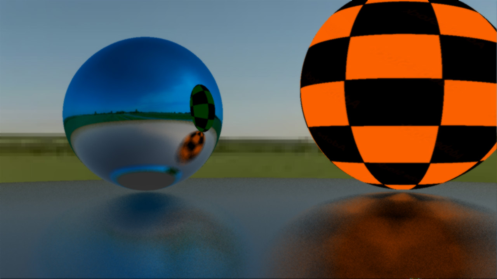
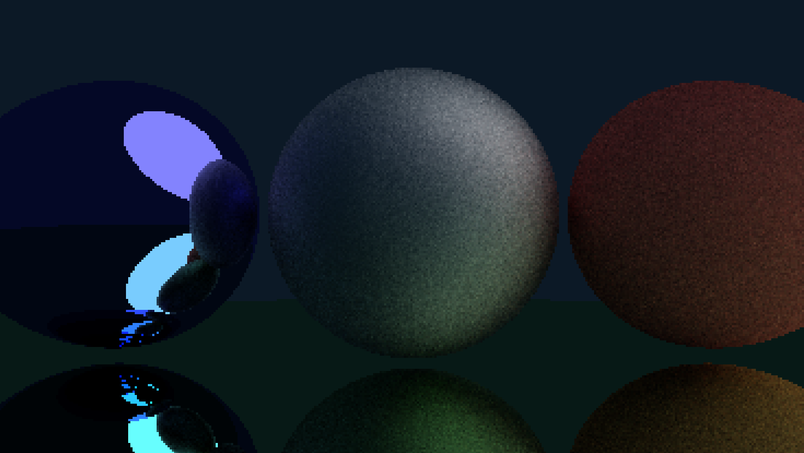
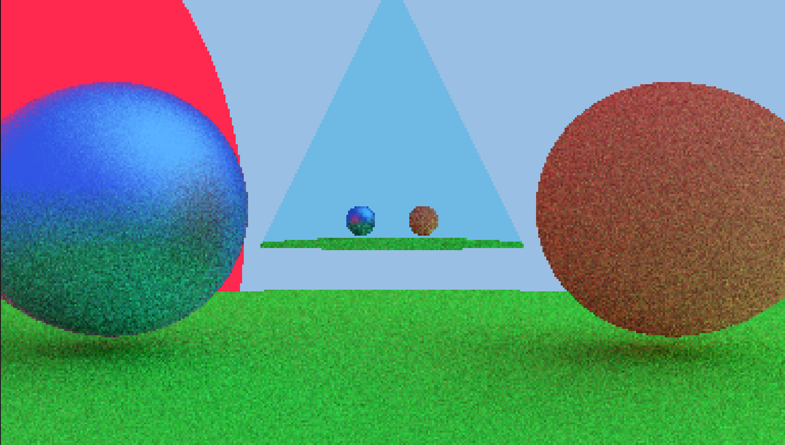
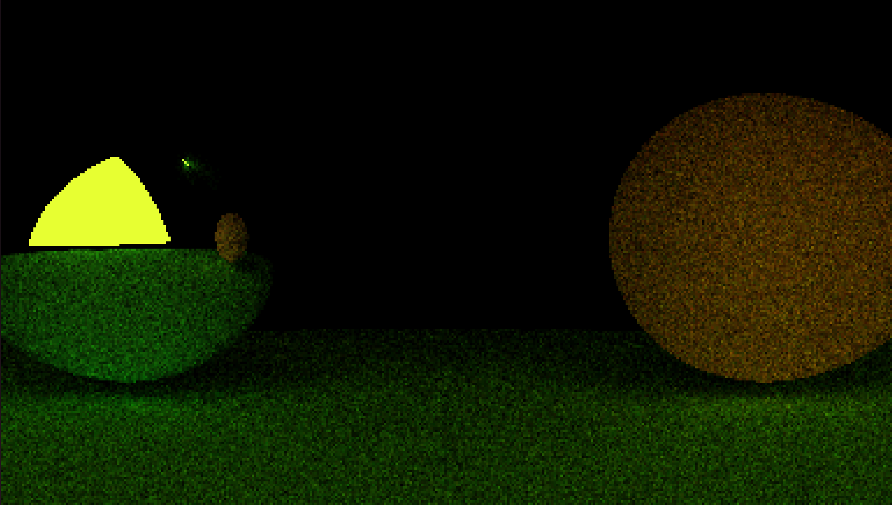
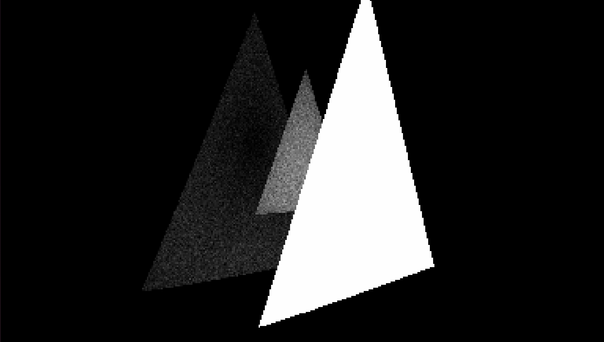
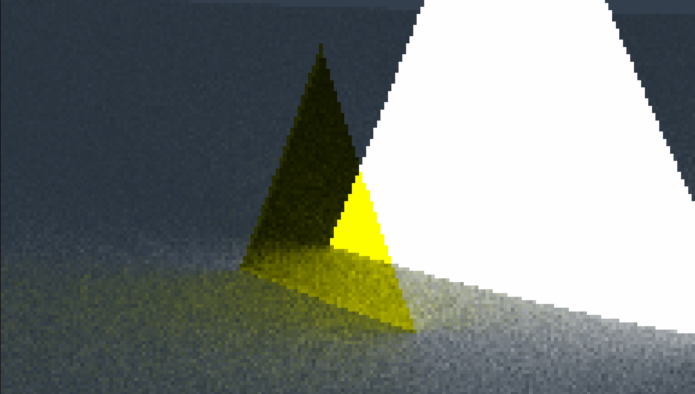

# Ray tracing
This app works propperly only on linux and when build with compile.sh. the .exe is broken...
Link to the unfinished document of [my thesis](https://docs.google.com/document/d/1KeSsijYhDNzzKu8QZtLVjfMsUvvey8fzT-DooFDNbP4/edit?usp=sharing).

## To do
- Windows/cuda port
- Refactor
- UI & drag and drop

## Screenshots

