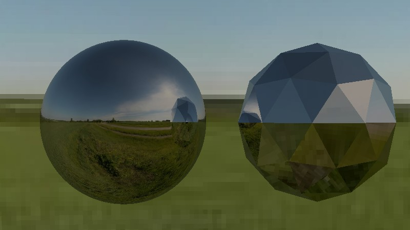
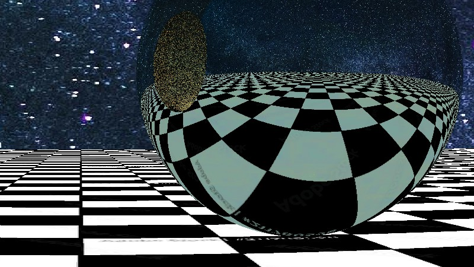

# Ray tracing
This app works propperly only on linux and when build with `./manager.sh build run`.
Tis is a work for school: [my thesis](./bin/thesis.pdf).

(controls are like in minecraft due tu a recent update)

## To do
- Windows/cuda port
- Refactor
- UI & drag and drop
- Non metalic materials

## Screenshots

