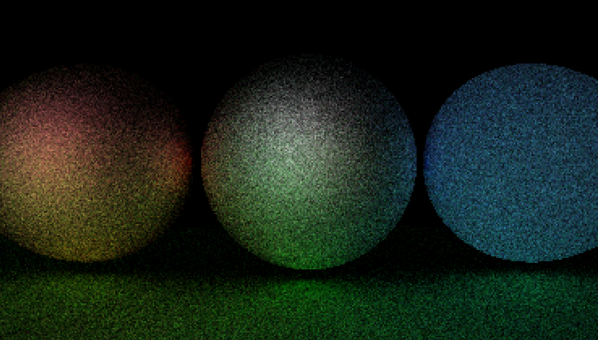

# Ray tracing
This app works propperly only on linux and when build with compile.sh. the .exe is broken...
Link to the unfinished document of [my thesis](https://docs.google.com/document/d/1WiTNyBNXwmvZ5U-SpcQe-R32jS9g18AwrN0oglSlPGA/edit?usp=sharing).

## To do
- all the images are from earlier commits using C#. now im migrating to c++ so there is not all the functionality...

## Screenshots

