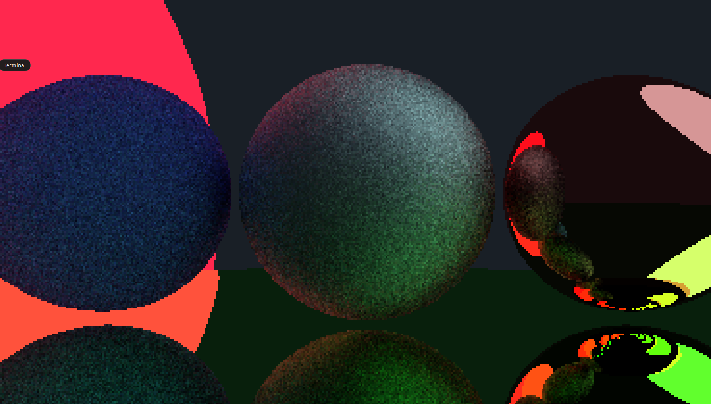

# Ray tracing
This app works propperly only on linux and when build with compile.sh. the .exe is broken...
Link to the unfinished document of [my thesis](https://docs.google.com/document/d/1WiTNyBNXwmvZ5U-SpcQe-R32jS9g18AwrN0oglSlPGA/edit?usp=sharing).

## To do
* Make a sceen maker application which generates a JSON file in order to get readed by the programme.
* Use the triangles to read meshes of 3D models.
* Increase the performance with GPU processing via shaders, vulcan, cuda... Or something else.
* Migrate to a more efficient and safe language like rust.
* 2D map preview.

## Screenshots

